# ☁️ Awesome VMware Cloud Hosting & Virtualization Ecosystem 🚀

  
  
  
  
  
  

---

## 📌 Executive Overview & Market Context

Welcome to the **Awesome VMware Cloud Hosting & Open-Source Virtualization Guide**! This repository tracks premier **SaaS managed VMware platforms**, **open-source hypervisors**, **hybrid-cloud control planes**, and **VM migration utilities** for infrastructure architects, sysadmins, and IT leaders evaluating virtualization strategies post-Broadcom acquisition.

Whether you are looking to run **VMware SDDC workloads natively on hyperscaler bare-metal** (AWS, Azure, Google Cloud, Oracle) or migrate to enterprise-grade **open-source hypervisors** like **KubeVirt**, **OpenStack**, **Harvester**, **CloudStack**, **Proxmox VE**, or **XCP-ng**, this list provides up-to-date pricing, Stars_Counts, and feature breakdowns.

---

## 📑 Table of Contents

- [☁️ SaaS / Hosted VMware Platforms](#%EF%B8%8F-saas--hosted-vmware-platforms)
- [🛠️ Open-Source GitHub Virtualization Projects](#%EF%B8%8F-open-source-github-virtualization-projects)
- [🤝 How to Contribute](#-how-to-contribute)
- [⚠️ Disclaimer & Licensing Notes](#%EF%B8%8F-disclaimer--licensing-notes)
- [💖 Support & Sponsorship](#-support--sponsorship)
- [📊 Star History](#-star-history)

---

## ☁️ SaaS / Hosted VMware Platforms

> **📊 Market Overview & Industry Dynamics**:  
> The global **VMware Cloud & Managed Virtualization market** is estimated at **$15+ Billion**. The sector is **moderately concentrated** among major hyper-scalers (AWS, Microsoft Azure, Google Cloud) while remaining **fragmented across specialized managed hosting service providers**. Following Broadcom's shift to bundled VMware Cloud Foundation (VCF) subscriptions, organizations are actively evaluating both hyperscaler managed nodes and on-premise open-source alternatives.

| 🏢 SaaS Platform | 📝 Description | 📈 Company Scale (Valuation / Revenue) | 💵 Starting Price | 🎁 Free Tier / Trial Limit |
| :--- | :--- | :--- | :--- | :--- |
| **[Google Cloud VMware Engine](https://cloud.google.com/vmware-engine)** | Google Cloud's managed VMware service with 99.99% SLA and native GCP BigQuery/Anthos integration. | **$4.20 Trillion** (Market Cap) | ~$9.00 / host / hour | No free tier; $300 GCP credit cannot be used for GCVE (requires paid account) |
| **[Azure VMware Solution](https://azure.microsoft.com/en-us/products/azure-vmware/)** | Microsoft's fully managed VMware service running on Azure bare-metal infrastructure with Azure Hybrid Benefit. | **$3.84 Trillion** (Market Cap) | ~$8.80 / host / hour (AV36P instance) | No free trial; $200 Azure signup credit available (requires sales PoC for host quota) |
| **[VMware Cloud on AWS](https://www.vmware.com/cloud-solutions/vmware-cloud-aws)** | Jointly engineered by VMware and AWS, delivering VMware SDDC on AWS bare metal with native AWS service integration. | **$2.71 Trillion** (Market Cap) | ~$8.00 - $12.00 / host / hour | No free tier or trial; standard AWS Free Tier credits do not apply to bare metal |
| **[Oracle Cloud VMware Solution](https://www.oracle.com/cloud/vmware/)** | Oracle's managed VMware offering with full root admin control, OCI integration, and zero-trust security. | **$425 Billion** (Market Cap) | ~$9.50 / host / hour (Min 8-hour billing) | No dedicated free trial; $300 Oracle Cloud credit available + no-cost LiveLabs |
| **[IBM Cloud for VMware Solutions](https://www.ibm.com/cloud/vmware)** | Enterprise managed VMware platform with global data center coverage and automated deployment. | **$205 Billion** (Market Cap) | ~$0.12 / vCPU / hour (Legacy existing accounts) | Closed to new signups as of Oct 2025; existing accounts get $200 30-day credit |
| **[Navisite VMware Cloud](https://www.navisite.com/)** | Managed VMware cloud services with migration, optimization, and 24/7 support for enterprise workloads. | **$125 Billion** (Parent: Accenture Market Cap) | Custom managed plan (~$150/VM/mo starting) | 30-day trial for managed cloud assessment & POC |
| **[OVHcloud Hosted Private Cloud](https://us.ovhcloud.com/)** | European managed VMware service with vSphere, NSX, and vSAN fully managed by OVHcloud. | **$2.80 Billion** (€2.5B Market Cap / $1.1B Rev) | ~$580 / month (Hosted Private Cloud Host) | No trial on Private Cloud; $200 free credit valid on OVH Public Cloud |
| **[Rackspace VMware Cloud](https://www.rackspace.com/)** | Managed VMware private cloud with Rackspace's Fanatical Support and hybrid cloud integration. | **$1.20 Billion** (Market Cap) | ~$1,500 / month (Dedicated Private Host) | No standard free trial; 14-day sponsored PoC available via sales |
| **[TierPoint VMware Cloud](https://www.tierpoint.com/)** | Managed VMware hosting with hybrid cloud, disaster recovery, and compliance-focused deployments. | **~$470 Million** (Annual Recurring Rev) | ~$1,200 / month (Managed Private Node) | No public free trial; custom 30-day PoC evaluation available upon request |
| **[Expedient VMware Cloud](https://www.expedient.com/)** | Managed VMware Cloud Foundation (VCF) platform serving 35,000+ enterprise workloads. | **~$250 Million** (Est. Private Rev) | ~$1,000 / month (Enterprise Cloud Node) | 30-day risk-free proof of concept / trial migration environment |

---

## 🛠️ Open-Source GitHub Virtualization Projects

The open-source ecosystem for virtualization, cloud orchestration, and VM migration is production-proven. The projects below are **sorted by GitHub_Stars_Count (Descending)**:

| 📦 Repository / Project | ⭐ GitHub_Stars_Badge | 📜 License | 📄 Key Capabilities & VMware Alternative Fit |
| :--- | :--- | :--- | :--- |
| **[KubeVirt](https://github.com/kubevirt/kubevirt)** |  | Apache-2.0 | **Cloud-native VM management on Kubernetes**. Enables running traditional virtual machine workloads side-by-side with containerized microservices. |
| **[OpenStack](https://github.com/openstack/openstack)** |  | Apache-2.0 | **The premier open-source IaaS cloud platform**. Full-suite VMware vSphere/VCF replacement for private & public clouds; supports KVM, Xen, and VMware ESXi hosts. |
| **[Harvester](https://github.com/harvester/harvester)** |  | Apache-2.0 | **Modern Hyper-Converged Infrastructure (HCI)** built on Kubernetes, KubeVirt, and Longhorn. Direct open-source alternative to VMware vSAN + vSphere. |
| **[OpenTelemetry Collector (vCenter Receiver)](https://github.com/open-telemetry/opentelemetry-collector-contrib)** |  | Apache-2.0 | **OpenTelemetry Collector receiver for vCenter/ESXi metrics**. Observability pipeline integration for vSphere 7.0/8.0 infrastructure metrics. |
| **[CloudStack](https://github.com/apache/cloudstack)** |  | Apache-2.0 | **Apache Top-Level private cloud orchestrator**. Turn-key cloud management for KVM, Xen, and ESXi hosts with direct guest migration from vSphere via UI. |
| **[Cloudpods](https://github.com/yunionio/cloudpods)** |  | Apache-2.0 | **Unified multi-cloud & hybrid cloud platform**. Turns existing VMware vSphere vCenter/ESXi clusters into multi-tenant private clouds with RBAC & self-service. |
| **[XCP-ng](https://github.com/xcp-ng/xcp)** |  | GPL-2.0 | **Fully open-source Xen-based hypervisor**. Drop-in alternative for Citrix Hypervisor / VMware ESXi. Managed via Xen Orchestra (XO) with warm V2V migration. |
| **[ZStack (ZSvirt Base)](https://github.com/zstackio/zstack)** |  | Apache-2.0 / GPL-3.0 | **Production-proven open-source virtualization engine**. Powers 10,000+ host deployments managing large-scale compute, storage, and networking. Includes ZMigrate tool. |
| **[Bareos](https://github.com/bareos/bareos)** |  | AGPL-3.0 | **Enterprise open-source backup & recovery**. Native VMware vCenter CBT (Change Block Tracking), Proxmox VE, and Hyper-V VM-level restore support. |
| **[virt-v2v](https://github.com/libguestfs/virt-v2v)** |  | GPL-2.0+ | **Standard CLI tool for converting VMs from VMware vCenter/OVA/VMX to KVM/OpenStack**. Supports NFS and HTTPS transport streams. |
| **[Proxmox VE (PVE Manager Mirror)](https://github.com/proxmox/pve-manager)** |  | AGPL-3.0 | **Leading open-source VMware vSphere replacement for mid-market enterprise**. KVM & LXC container management with ZFS/Ceph storage and ESXi import wizard. |
| **[check-vmware](https://github.com/atc0005/check-vmware)** |  | MIT | **Go-based Nagios/Icinga monitoring plugins for VMware**. Monitors tools status, vCPU, datastore space, snapshot age, and host performance. |
| **[h2kvm](https://github.com/zyvorai/h2kvm)** |  | GPL-3.0 | **Any hypervisor to KVM migration toolchain** (VMware, Hyper-V, AWS, Azure). Converts vSphere disks offline without VDDK dependencies. |
| **[vmware-monitor](https://github.com/zwindler/vmware-monitor)** |  | MIT | **Read-only VMware vSphere monitoring CLI tool**. Python pyVmomi CLI with AI assistant integration (Claude, Gemini, Codex) for infrastructure health checks. |

---

## 🤝 How to Contribute

Contributions are welcome! If you know of other high-quality SaaS platforms or open-source VMware alternative projects:

1. 🍴 **Fork** this repository.
2. 📝 **Add/edit entries** in `README.md` following the tabular layout.
3. 🔍 **Provide factual details**: name, link, 1–2 sentence description, pricing/stars, and license.
4. 🚀 **Submit a Pull Request** with a concise explanation.

---

## ⚠️ Disclaimer & Licensing Notes

- This repository is a **community-curated informational list** and does not constitute an endorsement.
- Broadcom's VMware licensing changes have restructured cloud provider partnerships and perpetual software model pricing. Always verify official terms before executing cloud migration plans.
- Self-hosted hypervisor platforms (e.g., OpenStack, Proxmox, KubeVirt) require active Linux sysadmin & networking expertise.
- **VDDK public availability notice**: VMware VDDK public downloads transitioned to partner channels in late 2026. Migration utilities using vSphere APIs now leverage NFS or HTTPS transport methods.

---

## 💖 Support & Sponsorship

If you find this repository helpful for your infrastructure research, enterprise cloud architecture, or VMware migration planning, please consider supporting the project!

- ⭐ **Star this repository** on GitHub to increase visibility.
- 🔀 **Fork & Share** with your fellow virtualization engineers and DevOps teams.
- ☕ **Buy me a coffee / Sponsor**: Support ongoing maintenance via [GitHub Sponsors](https://github.com/sponsors/ishandutta2007).

---

## 📊 Star History

---

  Made with ❤️ for infrastructure architects, virtualization engineers, and IT leaders evaluating cloud solutions.

